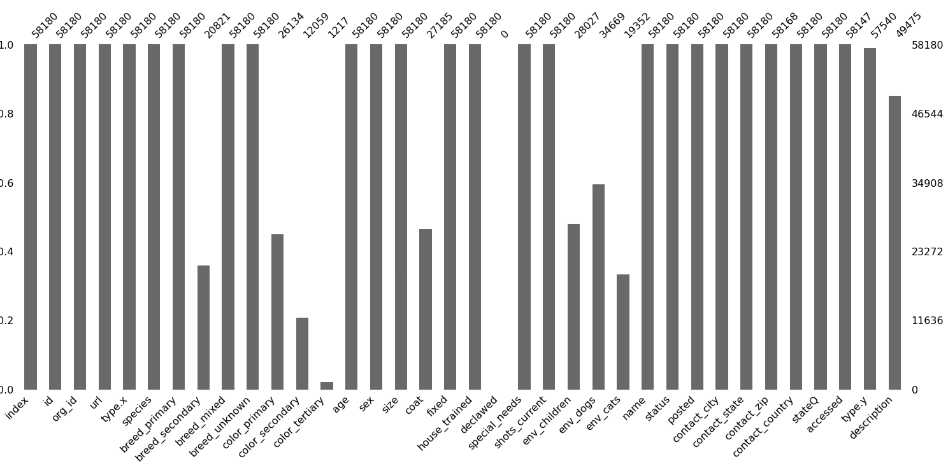

# Data Visualization

How can you visualize the data using Python?

This repository provides an overview of common vizualition options within Python

Exploratory data analysis (EDA) is much easier to interpret when visualization is provided.  Using a dataset from [Kaggle] (https://www.kaggle.com/datasets/thedevastator/adoptable-dogs-in-the-us) on "Adoptable Dogs in the US", I explore diffent visualization option using Python.

1. Matrix

This option is available when you import missingo. It provides a display of missing values and ignores columns with and NaNs. 

2. Bar Chart

Provides a view of the dataset so you can select the data you would like to analyse.  You can see all the columns including the values.  The larger the column the more dogs available within that breed.

3. Heatmap

A heatmap is a great way of looking for like data within a dataset.  
    When the value is close to -1, it means the one variable appears then the other variable is very likely to be missing.
    When the value is close to 0, it means that there is no dependence between the occurrence of missing values of the two variables.
    When the value is close to 1, it means one variable appears then the other variable is very likely to be present.

4. Seaborn

Seaborn provides a visualiztion based on matplotlib.  The rendering time is quick and provides customization that you can tweet to your liking. Seaborn.barplot is a simple bar chart that will provide quick view to see your data within the catagory you specify.  In this dataset I do a grouping of available dogs by breed.

5. Seaborn.countplot

Provides quantitive differences across categorical variables. Utilizing this method you can see how many adoptable dogs are house trained in the U.S. verses those that are not.

6. Maplotlib

This funcition generates a line plot of adoptable dogs over time.

7. Plotty Bar Chart

This options is interactive using Plotly and provides the count of dogs grouped by breed and uses a color per breed.

8. RoughViz Donut Plot

A quick pip install of py-roughviz will provide a sketch-board view on steriods!  I used this method to create an nteractive donut plot of mixed breeds among the adoptable dogs in the U.S.

And just think all of these visualization came from this CSV file! :)

* Special credit to [Medium](https://medium.com/mlearning-ai/visualization-tools-with-python-2d6c6a0d7a02) and [Meredith Wang](https://github.com/m3redithw/data-science-visualizations) for the content provided
